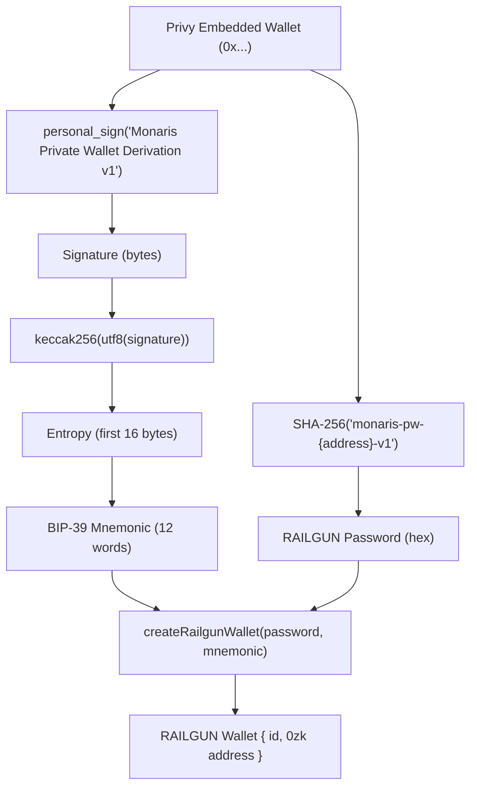

The RAILGUN wallet is derived deterministically from the user's Privy embedded wallet. The user signs one message on first login. The same wallet is always derived from the same signature.

## Derivation steps

```
STEP 1: PASSWORD DERIVATION
  SHA-256("monaris-pw-{walletAddress.toLowerCase()}-v1")
  → hex string used as RAILGUN wallet password

STEP 2: MNEMONIC DERIVATION
  User signs message: "Monaris Private Wallet Derivation v1"
  → signature (via personal_sign from Privy embedded wallet)
  → keccak256(utf8Bytes(signature)) → 32 bytes entropy
  → first 16 bytes → ethers.Mnemonic.fromEntropy()
  → 12-word BIP-39 mnemonic

STEP 3: RAILGUN WALLET CREATION
  createRailgunWallet(password, mnemonic, {})
  → { id, railgunAddress }
  → railgunAddress = 0zk... (RAILGUN shielded address)

RESULT:
  Same 0x address → same signature → same mnemonic → same 0zk address
  User never sees or manages the 0zk address
```

## Derivation flow diagram



## Key properties

| Property | Detail |
|----------|--------|
| **Deterministic** | Same Privy wallet always produces the same RAILGUN wallet |
| **Client-side only** | Private key material never leaves the browser |
| **One-time signature** | Mnemonic is cached in memory per session to avoid repeated sign prompts |
| **Encrypted backup** | Mnemonic is encrypted (AES-GCM, PBKDF2 100k iterations) and stored off-chain for recovery |

## What this means for users

The user connects their wallet and signs one message. From that point forward, they have a private payment capability — no 0zk address management, no separate wallet setup, no protocol interaction. The derivation is invisible.

If the user logs out and back in, the same signature produces the same mnemonic, which produces the same RAILGUN wallet. Their private balance is always accessible from their original wallet.

## Security model

- The mnemonic exists in browser memory only during the active session
- An encrypted copy (AES-GCM with PBKDF2 key derivation at 100,000 iterations) is stored off-chain for recovery
- Monaris servers never see the unencrypted mnemonic or spending key
- The derivation password is a deterministic hash — not user-chosen, not stored

## Related

- [Shield & Unshield Flows](/privacy/shield-unshield) — what happens after the wallet is created
- [Storage Architecture](/privacy/storage-architecture) — where keys and data are stored
- [Private Pay Guide](/pay/private-pay-guide) — user-facing overview
