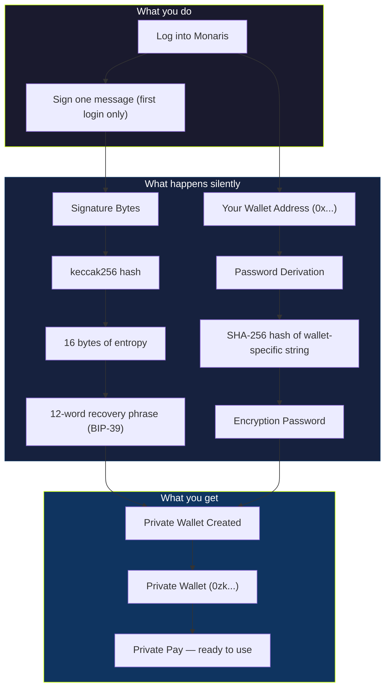

## The problem with privacy wallets

Every existing privacy solution forces users to create and manage a separate wallet. You get a new address (usually starting with `0zk`), you have to fund it separately, and you have to remember which wallet holds which funds. For most users, this is a dealbreaker.

Monaris eliminates this entirely.

## How Monaris solves it

When you log into Monaris, your private wallet is derived automatically from your existing wallet. You sign one message. That signature — combined with deterministic cryptographic functions — produces a private wallet that is always the same for your account. You never see it, manage it, or think about it.

```
Your existing wallet (0x...)
        ↓ sign one message
Deterministic derivation
        ↓
Private wallet (0zk...) — created silently
        ↓
Private Pay ready — one click
```

## The derivation architecture



## Key properties

<CardGroup cols={2}>
  <Card title="Deterministic" icon="fingerprint">
    Same wallet → same signature → same private wallet. Always. If you log out and back in, your private balance is exactly where you left it.
  </Card>
  <Card title="Client-side only" icon="lock">
    Your private key material never leaves your browser. Monaris servers never see your recovery phrase or spending keys. Ever.
  </Card>
  <Card title="One-time signature" icon="signature">
    You sign once on first login. After that, the derived wallet is cached in your session. No repeated prompts, no friction.
  </Card>
  <Card title="Encrypted backup" icon="cloud-arrow-up">
    Your recovery phrase is encrypted with military-grade encryption (AES-GCM, 100,000 rounds of key derivation) and stored as an encrypted blob for recovery.
  </Card>
</CardGroup>

## Technical specification

```
STEP 1 — PASSWORD
  Input:  "monaris-pw-{walletAddress.toLowerCase()}-v1"
  Hash:   SHA-256 → hex string
  Output: Encryption password (deterministic, not user-chosen)

STEP 2 — RECOVERY PHRASE
  Prompt: User signs "Monaris Private Wallet Derivation v1"
  Process: signature → keccak256 → first 16 bytes → BIP-39 mnemonic
  Output: 12-word recovery phrase

STEP 3 — WALLET CREATION
  createRailgunWallet(password, mnemonic, {})
  Output: { id, railgunAddress: "0zk..." }
```

## Security model

| Threat | Protection |
|--------|------------|
| Server compromise | Server never has unencrypted keys — only encrypted blobs |
| Browser compromise | Keys exist in memory only during active session |
| Recovery needed | Encrypted backup can be decrypted only with wallet signature |
| Replay attack | Derivation is wallet-address-specific — different wallets produce different private wallets |

**The critical invariant:** raw private key material exists only in browser memory and an encrypted backup. Monaris infrastructure never sees unencrypted keys.

---

## What comes next

<Card title="Shield & Unshield Flows" icon="arrow-right" href="/privacy/shield-unshield">
  Now that you understand how the private wallet is created, learn how funds move in and out of the private pool.
</Card>
