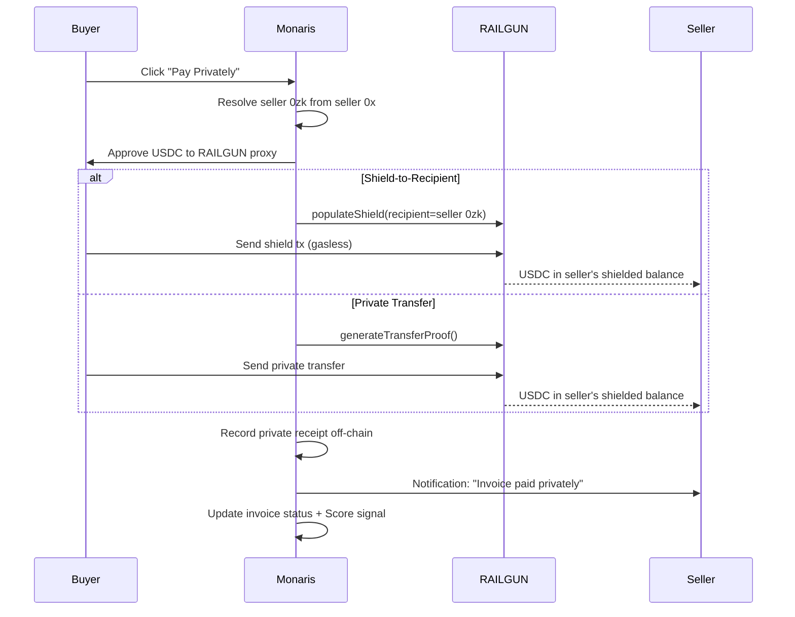

Two modes exist for sending private payments through Monaris. The mode is selected automatically based on the sender's balance state.

## Mode A — Shield-to-Recipient (from public balance)

Used when the sender has USDC in their public 0x wallet and wants to pay a recipient privately.

1. Resolve seller's 0zk address from their 0x address (deterministic derivation)
2. Approve USDC to RAILGUN proxy
3. Build shield transaction with `recipient = seller's 0zk address`
4. Send — USDC goes directly into seller's private balance
5. Record receipt off-chain, notify seller

The sender's public USDC moves directly into the recipient's shielded balance in a single transaction. The sender does not need to shield first.

## Mode B — Private Transfer (from shielded balance)

Used when the sender already has shielded USDC in their private balance.

1. Initialize wallet, check shielded balance
2. Resolve recipient's 0zk address
3. Generate transfer proof (Groth16)
4. Send private transfer through RAILGUN pool
5. Record receipt off-chain, notify seller

This mode is fully private end-to-end. Both the sender's and recipient's funds are in the shielded pool throughout. The on-chain footprint is a single ZK proof.

## End-to-end flow diagram

## When each mode is used

| Scenario | Mode | Why |
|----------|------|-----|
| Sender has public USDC, no shielded balance | Mode A | Shield directly to recipient — one tx |
| Sender has shielded USDC from prior shield | Mode B | Private transfer within shielded pool |
| Sender has both public and shielded USDC | Either | Monaris selects optimal path |

## What happens after payment

Regardless of mode:

- **Invoice** is marked as cleared in the InvoiceRegistry
- **Score signal** is registered (payment amount, timeliness)
- **Private receipt** is stored off-chain for both parties
- **Seller notification** is sent ("Invoice paid privately")
- **Seller can unshield** received funds to their public wallet at any time

## Related

- [Shield & Unshield Flows](/privacy/shield-unshield) — full details on shield/unshield mechanics
- [POI Pipeline](/privacy/poi-pipeline) — how received funds become spendable
- [Settlement Waterfall](/reference/settlement-waterfall) — the full on-chain settlement flow
