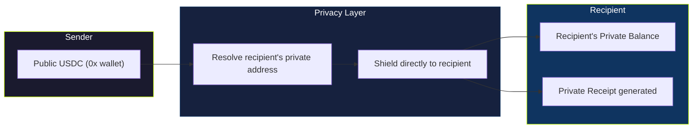
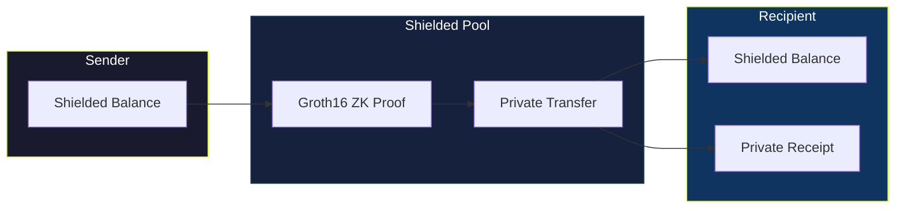
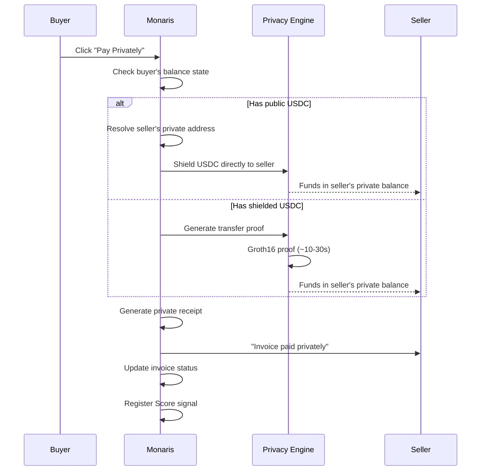
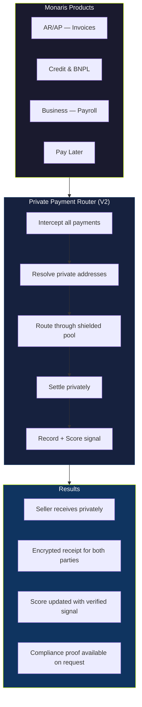
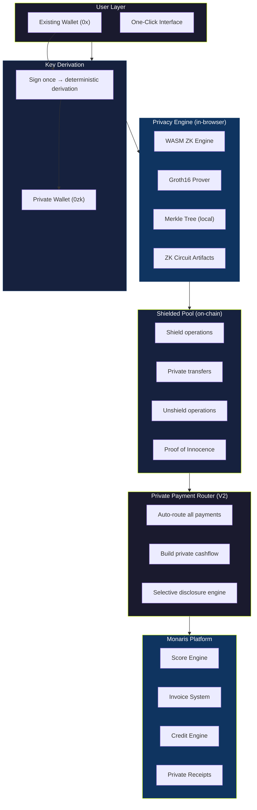

## How private payments work today

Monaris supports two modes for sending private payments. The system selects the optimal mode automatically based on where the sender's funds are.

---

## Mode A — Direct Shield to Recipient

**When:** You have public USDC and want to pay someone privately.

Your USDC goes directly from your public wallet into the recipient's private balance — in a single transaction.



**What happens:**
1. Monaris resolves the recipient's private address from their public address (deterministic — see [Key Derivation](/privacy/key-derivation))
2. USDC is approved to the privacy contract
3. A shield transaction is built with the recipient's private address as the target
4. One gasless transaction — USDC enters the recipient's private balance directly
5. Private receipt generated, invoice marked cleared, Score updated

**On-chain visibility:** A deposit into the shielded pool. That is all. No link between sender and recipient.

---

## Mode B — Private Transfer (Pool to Pool)

**When:** You already have shielded USDC from a previous shield operation.

Funds move entirely within the private pool. The sender's shielded balance decreases; the recipient's shielded balance increases. The on-chain footprint is a single ZK proof.



**What happens:**
1. Sender's wallet initializes, checks shielded balance
2. Recipient's private address is resolved
3. A Groth16 proof is generated in-browser (~10–30 seconds)
4. The proof is submitted on-chain — funds move within the pool
5. Private receipt generated, invoice marked cleared, Score updated

**On-chain visibility:** A ZK proof was submitted. Nothing else. No amounts, no addresses, no patterns.

---

## End-to-end: what a private payment looks like



After payment, the seller can:
- **Keep funds shielded** — maintain private balance for future private payments
- **Unshield to public wallet** — move funds back to their 0x address anytime
- **Pay their own vendors privately** — private cashflow chain

---

## V2: Private Payment Router — The Future of Private Commerce

<Note>
**Coming in V2** — the architecture below describes where Monaris Private is heading.
</Note>

Today, users explicitly choose to pay privately. In V2, **privacy becomes the default settlement path** for every payment through Monaris — not an opt-in feature, but the standard rail.

### What the Private Payment Router does

The Private Payment Router sits between every Monaris product and the settlement layer. Every invoice payment, every BNPL repayment, every payroll transfer — all route through it automatically.



### Private cashflow — a new primitive

When sellers receive payments through the Private Payment Router, something powerful happens: **they build private cashflow history.**

```
Traditional cashflow:
  Invoice cleared → payment on public chain → visible to everyone → Score

Private cashflow (V2):
  Invoice cleared → payment through Private Router → shielded from public view
       ↓
  Seller's private balance grows
       ↓
  Score still updates (verified internal signal)
       ↓
  Seller pays their vendors privately (chain continues)
       ↓
  Private cashflow history builds over time
       ↓
  Credit decisions based on verified private history
```

This means:
- **Sellers build financial history** without exposing it publicly
- **Competitors cannot map** client relationships, revenue, or vendor networks
- **Payment patterns remain private** — no one can analyze frequency, size, or timing
- **Credit decisions still work** — the MCA has access to verified internal data, not public chain data

### What changes for users

| Feature | V1 (now) | V2 (Private Router) |
|---------|----------|---------------------|
| Private payments | Opt-in per payment | Default for all payments |
| Seller receives | Public or private (sender chooses) | Private by default |
| Cashflow history | Public chain visible | Private, verified internally |
| Score calculation | On-chain signals | Private verified signals |
| Compliance | Manual selective disclosure | Automated compliance proofs |
| Payroll | Public transactions | Fully private disbursements |
| BNPL repayment | Public transactions | Private settlement |

### Selective Disclosure in a private-first world

Even with all payments private by default, users retain full control over what they prove:

- **"This invoice was paid on time"** — ZK proof, no amount revealed
- **"My monthly revenue exceeds $10,000"** — range proof, no individual payments revealed  
- **"My Score is above 700"** — Score proof, no transaction history revealed
- **"I paid this vendor"** — payment proof for compliance, no other payments revealed

The proofs are generated client-side. No one — not even Monaris — can generate a proof about your data without your explicit action.

---

## The full privacy architecture



**This is the endgame:** a financial system where privacy is not a feature you toggle on — it is the infrastructure everything runs on. Payments are private. Cashflow is private. Credit decisions are made on verified private data. And the user controls exactly what to prove, to whom, and when.

---

## Related

- [Key Derivation](/privacy/key-derivation) — how the private wallet is created
- [Shield & Unshield Flows](/privacy/shield-unshield) — how funds enter and exit the shielded pool
- [Secrets as a Service](/privacy/secrets-as-a-service) — programmable privacy rules and selective disclosure
