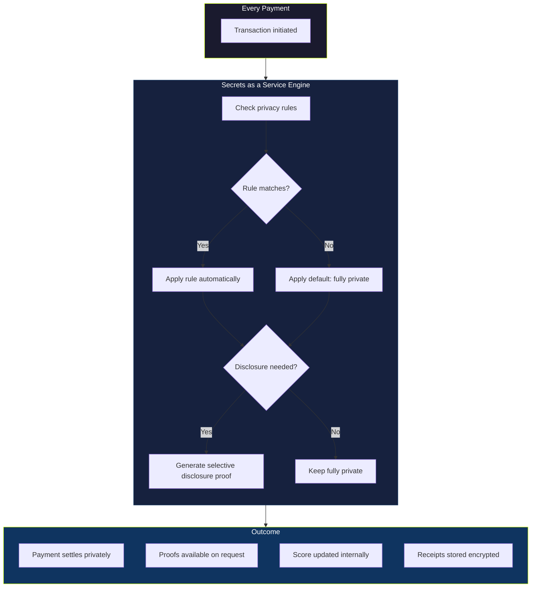
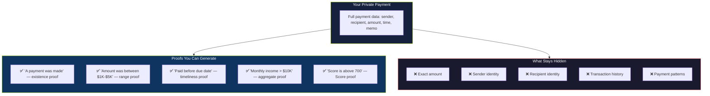
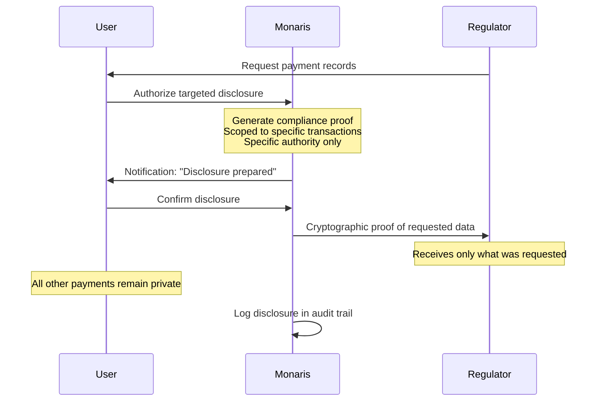
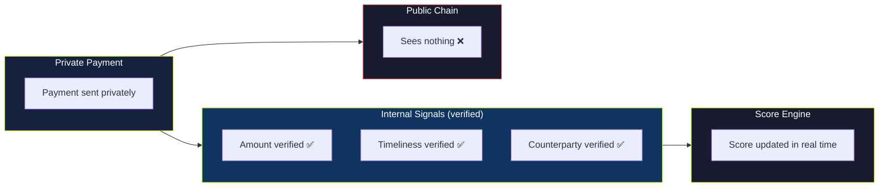

Secrets as a Service is Monaris's programmable privacy framework. You define rules for what stays private, what can be disclosed, and to whom — at the transaction level or account level. The core principle: **privacy and verifiability are not opposites.** You can keep a payment completely private while still proving it happened.

## Who this is for

Anyone who wants fine-grained control over their financial privacy on-chain — from freelancers who want basic privacy to businesses that need compliance-ready disclosure capabilities.

## How it works

Every payment through Monaris is private by default. Secrets as a Service adds a programmable layer on top — rules that run automatically, selective disclosure for proving claims without revealing data, and compliance mode for regulated entities.

## Programmable privacy rules

You define rules once. They run automatically on every matching transaction.

**Examples:**

- **"All payments above $5,000 are always private"** — amount threshold triggers maximum privacy
- **"All payments to Vendor A are private"** — counterparty-based rule
- **"Payroll payments are private — but generate a verifiable receipt"** — privacy with audit trail
- **"Private by default — except when I choose to share a proof"** — manual override only
- **"All payments private — my Score data is shareable for credit purposes"** — privacy with Score portability

Rules can be combined and layered. Business accounts can enforce rules across all team members.

```mermaid
flowchart LR
    subgraph RuleTypes["Rule Types"]
        direction TB
        Amount["Amount-based"]
        Counter["Counterparty-based"]
        Category["Category-based"]
        Time["Time-based"]
    end

    subgraph Triggers["Trigger Conditions"]
        direction TB
        T1["Payment > $5,000"]
        T2["Recipient = Vendor A"]
        T3["Category = Payroll"]
        T4["After business hours"]
    end

    subgraph Actions["Privacy Actions"]
        direction TB
        A1["Maximum privacy — no disclosure"]
        A2["Private + verifiable receipt"]
        A3["Private + compliance proof"]
        A4["Private + Score signal only"]
    end

    RuleTypes --> Triggers --> Actions

    style RuleTypes fill:#1a1a2e,stroke:#CCFF04,color:#fff
    style Triggers fill:#16213e,stroke:#0f3460,color:#fff
    style Actions fill:#0f3460,stroke:#CCFF04,color:#fff
```

## Selective disclosure

This is the key insight: **what is secret** and **what is provable** are two separate controls. You set each independently.

**Use cases for selective disclosure:**

- A **lender** needs to verify income → you prove "monthly income exceeds $5,000" without revealing exact amounts or who pays you
- A **client** wants proof of payment → you share a cryptographic receipt proving the exact payment, nothing else
- A **tax authority** requires records → you generate verifiable receipts for specific transactions only
- A **partner** evaluates creditworthiness → you share your Score proof without revealing any underlying data

## Feature access by plan

| Feature | Free | Pay User | Business |
|---------|------|----------|----------|
| Private payments by default | ✓ | ✓ | ✓ |
| Custom privacy per transaction | — | ✓ | ✓ |
| Programmable privacy rules | — | — | ✓ |
| Selective disclosure proofs | — | ✓ | ✓ |
| Privacy audit log | — | ✓ | ✓ |
| Team privacy policy | — | — | ✓ |
| Compliance disclosure mode | — | ✓ | ✓ |

## Compliance mode

For regulated entities that need to disclose payment information to regulators on request — without making anything public.

**Key guarantees:**

- **Targeted disclosure** — share only with the named regulatory authority, not the public chain
- **Full audit log** — complete record of every disclosure: what was shared, with whom, when
- **User notification** — you are notified and must confirm before any disclosure is made
- **Privacy preserved** — compliance disclosure does not affect your default privacy for any other purpose

## Privacy and your Monaris Score

Privacy does not reduce your Score. The Monaris Score is calculated from internal verified signals — not from public chain data. Your payments can be completely private on-chain while your Score updates normally in the background.

## Availability

<Note>
Programmable privacy rules, selective disclosure proofs, and compliance mode are **available in V2**. Default private payments are active from V1 for all payments sent through Monaris.
</Note>

## FAQ

**Do I need to set up privacy rules to be private?**
No. Privacy is the default. Rules give you additional control over when and how privacy applies — but basic privacy works out of the box.

**Can a third party see my transactions if I use Monaris?**
Not by default. Only a proof-of-payment exists on-chain, which is verifiable but not readable. You choose what to disclose and to whom.

**How does compliance mode work with privacy?**
Compliance mode is targeted disclosure — you share specific information with a specific regulatory authority. It does not make your data public. Everything else remains private.

**Can I revoke a selective disclosure proof?**
Proofs can have expiry dates and can be revoked. Once revoked, the proof no longer verifies for the recipient.
