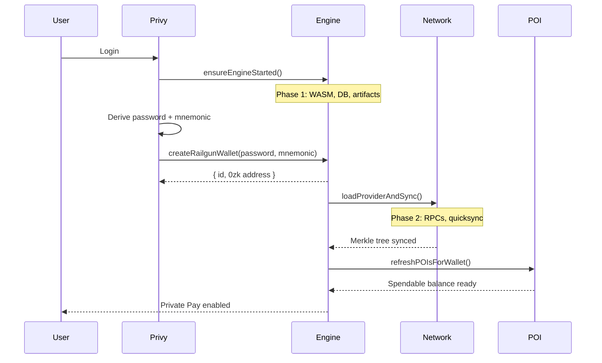
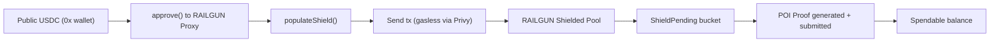

## Two-phase engine initialization

RAILGUN requires a two-phase boot sequence. This is invisible to the user.

```
PHASE 1 — ENGINE START (no network)
  ├── Initialize RAILGUN WASM engine
  ├── Open local database for merkle tree state
  ├── Open artifact store for ZK circuit files (zkeys, wasm)
  └── Configure POI aggregator nodes

PHASE 2 — PROVIDER LOAD (network-dependent)
  ├── Connect to network RPCs
  ├── Trigger quicksync (download compressed merkle tree)
  ├── Must run AFTER wallet import (so quicksync matches UTXOs to viewing key)
  ├── Retries up to 4 times with exponential backoff (3s → 6s → 12s → 24s)
  └── Once synced: balances available, transactions possible
```

### Initialization sequence diagram



---

## Shield flow — moving USDC from public to private

Shielding moves public USDC (visible on-chain) into the RAILGUN shielded pool (private).

```
1. User approves USDC to RAILGUN proxy contract
   → approve(0xFA70...4b9, amount) on USDC contract

2. Build shield transaction
   → Generate random shieldPrivateKey (32 bytes)
   → Construct shieldERC20Recipients: [{ token, amount, recipient: 0zk address }]
   → populateShield() → returns { to, data, value }

3. Send transaction
   → Privy sends tx to RAILGUN proxy (gasless via Privy gas sponsorship)
   → On-chain: USDC transferred to shielded pool, UTXO created

4. Post-shield
   → Balance moves to "ShieldPending" bucket
   → POI proof submitted → moves to "Spendable" bucket (takes ~1-2 minutes)
```

### Shield flow diagram



---

## Unshield flow — moving USDC from private to public

Unshielding generates a ZK proof (Groth16 SNARK) and moves funds from the shielded pool back to a public 0x address.

```
1. Trigger balance scan (refresh merkle tree)

2. Initialize Groth16 prover
   → snarkjs WASM prover runs in browser (no server)
   → Clear artifact memory cache to avoid stale data

3. Generate unshield proof
   → gasEstimateForUnprovenUnshield() → gas estimate
   → generateUnshieldProof() → Groth16 proof (π_A, π_B, π_C + public signals)
   → Progress callback updates UI ("Generating proof... 40%")

4. Populate proved transaction
   → populateProvedUnshield() → { to, data, value, gasEstimate }

5. Send transaction
   → Privy sends tx (gasless)
   → USDC appears in public 0x wallet
```

## Proof system

| Property | Value |
|----------|-------|
| **Circuit** | Groth16 on BN128 curve |
| **Prover** | snarkjs ^0.7.6 (WASM, runs in browser) |
| **Circuit type** | 2x2 PoseidonMerkle |
| **Proof elements** | π_A (G1 point), π_B (G2 point), π_C (G1 point), public signals |
| **Trusted server** | None — all proving happens client-side |

## Related

- [Key Derivation](/privacy/key-derivation) — how the RAILGUN wallet is created
- [Private Payment Modes](/privacy/private-payment-modes) — how payments flow after shielding
- [POI Pipeline](/privacy/poi-pipeline) — how funds become spendable
