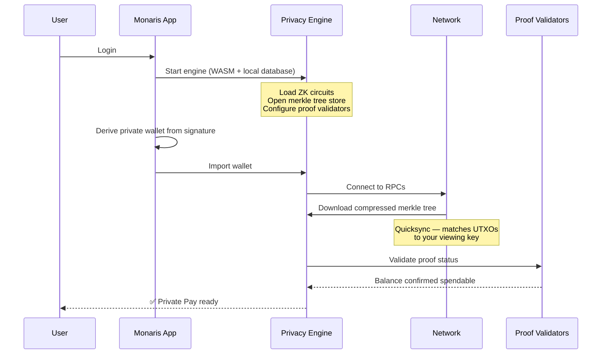
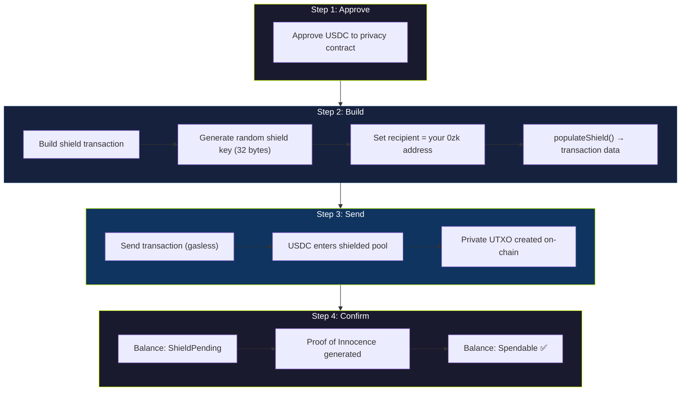
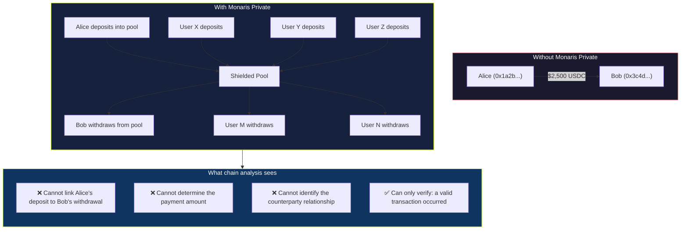

## The two states of your money

In Monaris, your USDC exists in one of two states:

| State | Visibility | What you can do |
|-------|-----------|-----------------|
| **Public** | Visible on-chain to everyone | Send normal payments, receive funds |
| **Shielded** | Hidden behind ZK proofs | Send private payments, receive privately |

**Shielding** moves funds from public → private. **Unshielding** moves them back. Both happen in one click.

---

## How the engine boots

Before any private operation, the privacy engine initializes silently in the background. The user sees nothing — this happens during login.



The engine retries up to 4 times with exponential backoff if network sync fails. Once sync completes, your private balance is available.

---

## Shield — moving funds into privacy

Shielding takes USDC from your public wallet and deposits it into the shielded pool. After shielding, the funds are private — no one can see the balance, the owner, or the origin.

### What happens step by step



**What the chain sees:** USDC was transferred to a pool contract. Nothing more. No link to your private balance.

**Time to spendable:** ~1–2 minutes after the transaction confirms.

---

## Unshield — moving funds back to public

Unshielding generates a zero-knowledge proof that you own funds in the pool, and transfers them back to your public wallet — without revealing which deposit those funds came from.

### The proof generation process

This is where the cryptography happens. The entire proof is generated in your browser — no server involved.

```
1. SCAN      →  Refresh merkle tree to find your UTXOs
2. PROVE     →  Generate Groth16 ZK proof (in-browser, ~10-30 seconds)
3. POPULATE  →  Build transaction with proof attached
4. SEND      →  Submit transaction (gasless)
5. RECEIVE   →  USDC appears in your public wallet
```

### Proof system details

| Component | Specification |
|-----------|--------------|
| **Proof system** | Groth16 (most efficient ZK-SNARK) |
| **Curve** | BN128 |
| **Prover** | snarkjs ^0.7.6 — runs entirely in-browser via WASM |
| **Circuit type** | 2x2 PoseidonMerkle |
| **Proof elements** | π_A (G1), π_B (G2), π_C (G1) + public signals |
| **Server involvement** | None — 100% client-side |

The proof mathematically demonstrates: *"I own funds in this pool and I am authorized to withdraw them"* — without revealing which specific deposit is being withdrawn, when it was made, or by whom.

---

## The privacy guarantee



The shielded pool acts as an **anonymity set**. When Alice shields funds and Bob unshields, the ZK proof breaks the on-chain link between the two transactions. Even sophisticated chain analysis cannot connect deposits to withdrawals — because the proof reveals nothing about which deposit funded which withdrawal.

---

## What comes next

<CardGroup cols={2}>
  <Card title="Private Payment Modes" icon="arrow-right" href="/privacy/private-payment-modes">
    Learn how shielded funds are used to send private payments — including the future Private Payment Router.
  </Card>
  <Card title="Key Derivation" icon="key" href="/privacy/key-derivation">
    Understand how the private wallet is created from your existing address.
  </Card>
</CardGroup>
