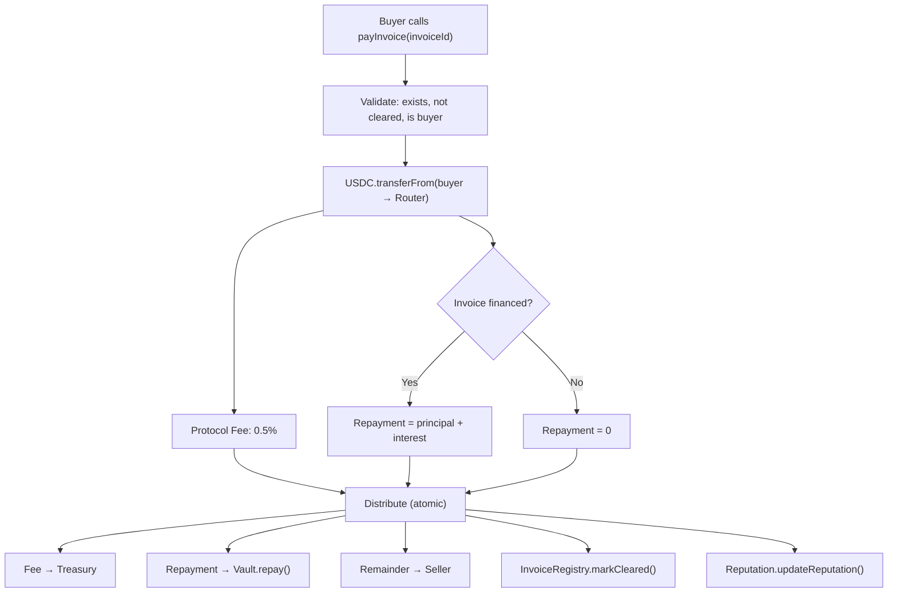

## Overview

When a buyer calls `payInvoice(invoiceId)` on the SettlementRouter, the following waterfall executes in a single atomic transaction. If any step fails, the entire transaction reverts.

## Settlement steps

```
1. VALIDATE
   → Invoice exists, not yet cleared, caller is buyer

2. TRANSFER
   → USDC.transferFrom(buyer, SettlementRouter, invoice.amount)

3. CALCULATE
   → protocolFee = amount × 0.5% (50 bps)
   → repaymentAmount = AdvanceEngine.getRepaymentAmount(invoiceId)
     (principal + interest, or 0 if not financed)
   → sellerAmount = amount - protocolFee - repaymentAmount

4. DISTRIBUTE (single atomic transaction)
   → protocolFee → Treasury address
   → repaymentAmount → Vault.repay() + AdvanceEngine.markRepaid()
   → sellerAmount → Seller wallet

5. FINALIZE
   → InvoiceRegistry.markCleared(invoiceId)
   → Reputation.updateReputation(seller, amount)
   → Emit InvoiceSettled event
```

## Settlement waterfall diagram



## Fee structure

| Component | Calculation | Recipient |
|-----------|-------------|-----------|
| Protocol fee | `amount × 0.5%` (50 bps) | Treasury address |
| Advance repayment | `principal + accrued interest` | Vault (via `Vault.repay()`) |
| Seller payout | `amount - fee - repayment` | Seller wallet |

If the invoice was not financed (no advance taken), the repayment amount is zero and the seller receives the full amount minus the protocol fee.

## Example

```
Invoice amount:     $10,000 USDC
Protocol fee:       $50 (0.5%)
Advance taken:      $7,000 (with $200 interest accrued)
Repayment:          $7,200

Distribution:
  → Treasury:       $50
  → Vault repay:    $7,200
  → Seller:         $2,750

Total out:          $10,000 ✓
```

## Atomicity

The entire waterfall — validation, transfer, fee calculation, distribution, invoice status update, and reputation update — executes in a single transaction. If any step fails (insufficient balance, invalid invoice state, contract revert), the entire transaction reverts. No partial settlements are possible.

## Events emitted

The `InvoiceSettled` event is emitted on successful completion, containing:

- Invoice ID
- Buyer address
- Seller address
- Total amount
- Protocol fee
- Repayment amount (if applicable)
- Seller payout amount

## Related

- [Smart Contracts Reference](/reference/smart-contracts) — contract addresses and invoice lifecycle
- [Invoice Advance](/credit/invoice-advance) — how advances work with the waterfall
- [Monaris Credit](/credit/monaris-credit) — credit products that interact with settlement
