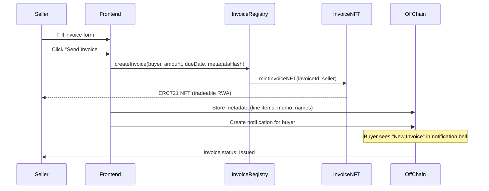

## Contract addresses (live on mainnet)

| Contract | Address | Role |
|----------|---------|------|
| InvoiceRegistry | `0x7a80...eB2` | Invoice creation, status tracking, NFT minting |
| InvoiceNFT | `0x14F3...D31` | ERC721 — each invoice is a tradeable NFT |
| SettlementRouter | `0x9037...36d` | Payment entry point, settlement waterfall |
| Vault | `0x61Cc...537` | Liquidity pool (LP deposits USDC, receives USMT+) |
| AdvanceEngine | `0x0D8D...08E` | Borrow against invoices from Vault |
| Reputation | `0x6baD...C73` | On-chain credit scoring (0–1000, tiers A/B/C) |
| Staking | `0x8492...3e` | Stake USMT+ for sUSMT+ yield position |
| USMTPlus | `0x2508...fe1` | Receipt token for Vault deposits |
| USDC | `0xaf88...831` | Native USDC |

## Invoice lifecycle — on-chain status

```
Status 0: ISSUED    — Invoice created, NFT minted to seller
Status 1: FINANCED  — Seller took advance from Vault
Status 2: PAID      — Buyer paid via SettlementRouter
Status 3: CLEARED   — Waterfall complete, funds distributed
```

Status transitions are one-way: `0 → 1 → 2 → 3`

### On-chain data (immutable once created)

- Invoice ID, amount, buyer address, due date, metadata hash
- Status transitions are recorded as events

### Off-chain data (mutable metadata)

- Line items, memo, seller/buyer names, invoice number
- Draft invoices (before on-chain publish)
- Rejected status (buyer rejects before paying)
- Notifications (new invoice, paid, rejected)

## Invoice creation — end-to-end



## Reputation system — on-chain

```
Score range: 0 — 1000
Score increment per cleared invoice: base 20 + volume bonus (1 point per 1M USDC)

Tier C: score < 500       → Basic access
Tier B: 500 ≤ score < 850 → Pay Later eligible, lower APR
Tier A: score ≥ 850       → Full credit access, best terms

Updated only by SettlementRouter.markCleared() — cannot be gamed manually
```

The on-chain Reputation contract is updated atomically as part of the settlement waterfall. There is no separate call required — every cleared invoice automatically updates the seller's reputation.

## Related

- [Settlement Waterfall](/reference/settlement-waterfall) — what happens when `payInvoice()` is called
- [Monaris Credit](/credit/monaris-credit) — how reputation unlocks credit products
- [Score Tiers](/score/tiers-explained) — how tiers map to product access
